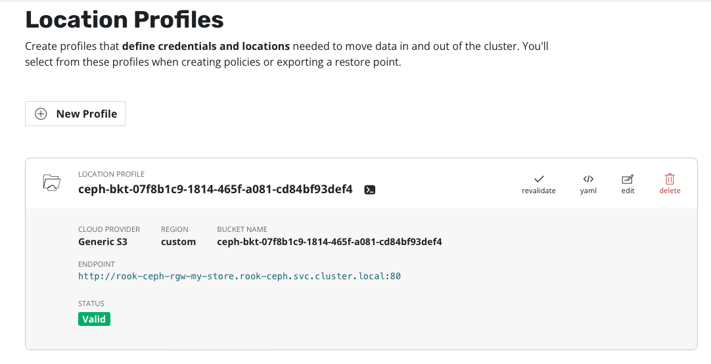
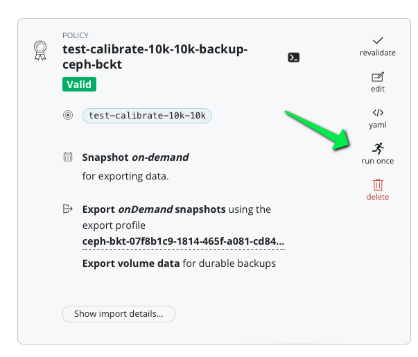

# Use standard IA with Kasten and CEPH

## Diclaimer 1 

This solution is a workaround, at some point (date unknown) Kasten will integrate a solution for using STANDARD_IA directly in Kasten and this workaround will be useless.

## Disclaimer 2 

This workaround is based on Topic and Notification on CEPH rados Gateway, my knowledge on CEPH administration is limited
and to facilitate my task I used the [Rook ceph operator](https://rook.io/). But if you are using a regular CEPH cluster 
you'll have to translate the operation done with the operator in pure CEPH operations. 

## Challenge 

### Kasten and Standard Infrequent Access (STANDARD_IA) storage class 

Kasten leverage the [Kopia](https://kopia.io/) datamover when sending the backup to the s3 object storage.

Kopia create mainly 2 category of files :
* the p file, they are blobs that store the bulk of snapshot data; they are mostly written once and not accessed again unless you restore or during repository compaction. Those files are the "Big" files and are good canditates for the STANDARD_IA storage class. 
* the rest which is mostly files participating in the index and used to compare the most recent snapshot with the previous backup to build an incremental export. Those files need to be accessed frequently and are not good candidate for STANDARD_IA but in the same times their sizes are very small (around Kb)

More details about [the files created by Kopia](https://kopia.io/docs/advanced/architecture/#content-addressable-block-storage-cabs).

In order to put the p file in STANDARD_IA and keep the rest on STANDARD storageclass. Kopia provide a mechanism based on a .storageconfig file [described here](https://kopia.io/docs/advanced/storage-tiers/). 

The .storageconfig file will tell Kopia to create the p file in STANDARD_IA and the rest in STANDARD storageClass.

```
{
   "blobOptions": [
     { "prefix": "p", "storageClass": "STANDARD_IA" },
     { "storageClass": "STANDARD" }
  ]
}
```

The challenge is that the .storageconfig file need to be populated on every kopia repository on the bucket (collections and repo) and must be created after the repository is initialized but before the first kopia snapshot. If you create the .storageconfig file before the repository is initialized you get an error kopia expect the path to be empty. If you do it after the first snapshot then some p file (eventually very big) will be put on the kopia repo in the STANDARD storageclass.

When Kasten will implement the solution it will create the .storageconfig file after the repo creation but before the first snasphot. However, 
for the moment this solution is not implemented in the product and we need to find another way to do it.

### Solution : using Topic and Notification 

Ceph Rados Gateway comes with a features called Topic/Notification that already existed with Amazone S3. This feature consist of sending a payload to a Service (Topic) if a specific Event occur on the bucket (Notification). A user can attached a Notification to one or multiple 
bucket and the event content (payload) will be sent to the exeternal service. 

For instance if a kopia repo is created, the kopia.repository file is created and if a notification is configured on the bucket this payload

```
{
  "Records": [
    {
      "eventVersion": "2.2",
      "eventSource": "ceph:s3",
      "awsRegion": "my-store",
      "eventTime": "2024-02-15T10:34:23.904497Z",
      "eventName": "ObjectCreated:Put",
      "userIdentity": {
        "principalId": "obc-my-buckets-ceph-bucket-16c82432-4ae2-47db-a7d6-fb175141b8a7"
      },
      "requestParameters": {
        "sourceIPAddress": ""
      },
      "responseElements": {
        "x-amz-request-id": "87b29a21-a0e2-4938-b225-89561cf1392c.83316.14254702881926680477",
        "x-amz-id-2": "14574-my-store-my-store"
      },
      "s3": {
        "s3SchemaVersion": "1.0",
        "configurationId": "detect-repository-file-creation",
        "bucket": {
          "name": "ceph-bkt-07f8b1c9-1814-465f-a081-cd84bf93def4",
          "ownerIdentity": {
            "principalId": "obc-my-buckets-ceph-bucket-16c82432-4ae2-47db-a7d6-fb175141b8a7"
          },
          "arn": "arn:aws:s3:my-store::ceph-bkt-07f8b1c9-1814-465f-a081-cd84bf93def4",
          "id": "87b29a21-a0e2-4938-b225-89561cf1392c.83322.1"
        },
        "object": {
          "key": "test5/kopia.repository",
          "size": 6,
          "eTag": "9a7fc1b14c3f14eb4262ee602a7f7fe6",
          "versionId": "",
          "sequencer": "AFE8CD6506C2FD36",
          "metadata": [],
          "tags": []
        }
      },
      "eventId": "1707993263.922599.9a7fc1b14c3f14eb4262ee602a7f7fe6",
      "opaqueData": "iamopaque"
    }
  ]
}
```

will be send to an external service. 

What we'll do is implement the service to capture the path 
```
test5/kopia.repository
```
and the bucket name 
```
ceph-bkt-07f8b1c9-1814-465f-a081-cd84bf93def4
```
to create the file 
```
test5/.storageconfig 
```
on the bucket.

Hence we create the .storageconfig file after the creation of the kopia repository but before the first snapshot.

## docs

Here is the documentation I used : 
* https://kopia.io/docs/advanced/architecture/#content-addressable-block-storage-cabs
* https://kopia.io/docs/advanced/storage-tiers/
* https://docs.ceph.com/en/latest/radosgw/placement/
* https://docs.ceph.com/en/latest/radosgw/pools/
* https://rook.io/docs/rook/latest-release/Storage-Configuration/Object-Storage-RGW/object-storage/#create-a-local-object-store
* https://knowledgebase.45drives.com/kb/kb450472-intelligent-tiering-with-lifecycle-management-on-ceph-s3/
* https://docs.aws.amazon.com/cli/latest/reference/s3api/put-bucket-notification-configuration.html#examples
* https://rook.io/docs/rook/latest/Storage-Configuration/Object-Storage-RGW/ceph-object-bucket-notifications/
* https://docs.aws.amazon.com/AmazonS3/latest/userguide/notification-content-structure.html

## Assumption 

This guide assumes a Rook cluster is installed as explained in the [Quickstart](https://rook.io/docs/rook/latest-release/Getting-Started/quickstart/).

## Create a new ceph object store to enable Rados Gateway

```
cat<<EOF |kubectl create -f - 
apiVersion: ceph.rook.io/v1
kind: CephObjectStore
metadata:
  name: my-store
  namespace: rook-ceph
spec:
  metadataPool:
    failureDomain: host
    replicated:
      size: 3
  dataPool:
    failureDomain: host
    erasureCoded:
      dataChunks: 2
      codingChunks: 1
  preservePoolsOnDelete: true
  gateway:
    sslCertificateRef:
    port: 80
    # securePort: 443
    instances: 1
EOF
```

After the CephObjectStore is created, the Rook operator will  create all the pools and other resources necessary to start the service. This may take a minute to complete.

check the gateway is here 
```
kubectl -n rook-ceph get pod -l app=rook-ceph-rgw 
```

You should get something like that 
```
rook-ceph-rgw-my-store-a-6cb574c979-2ts6b   2/2     Running   0          114s
```

Check the svc created 
```
k get svc rook-ceph-rgw-my-store
rook-ceph-rgw-my-store    ClusterIP   10.100.29.60     <none>        80/TCP              7m37s
```

Also you'll see the new pool 
```
oc create -f https://raw.githubusercontent.com/rook/rook/master/deploy/examples/toolbox.yaml
kubectl -n rook-ceph exec -it deploy/rook-ceph-tools -- bash
ceph osd pool ls
.mgr
.rgw.root
default.rgw.log
default.rgw.control
default.rgw.meta
my-store.rgw.control
my-store.rgw.meta
my-store.rgw.log
my-store.rgw.buckets.index
my-store.rgw.buckets.non-ec
my-store.rgw.otp
my-store.rgw.buckets.data
```


## Add a STANDARD_IA storage class

Create a replicapool for the STANDARD_IA
```
cat <<EOF |k create -f -
apiVersion: ceph.rook.io/v1
kind: CephBlockPool
metadata:
  name: replicapool
  namespace: rook-ceph
spec:
  failureDomain: host
  replicated:
    size: 3
EOF
```

Create the storage class STANDARD_IA 
```
radosgw-admin zonegroup placement add \
      --rgw-zonegroup my-store \
      --placement-id default-placement \
      --storage-class STANDARD_IA
```

Check 
```
radosgw-admin zonegroup get --rgw-zonegroup my-store |jq '.placement_targets'
[
  {
    "name": "default-placement",
    "tags": [],
    "storage_classes": [
      "STANDARD",
      "STANDARD_IA"
    ]
  }
]
```

Then provide the zone placement info for that storage class:
```
radosgw-admin zone placement add \
      --rgw-zone my-store \
      --placement-id default-placement \
      --storage-class STANDARD_IA \
      --data-pool replicapool 
```

check 
```
radosgw-admin zone get --rgw-zone my-store|jq '.placement_pools'
[
  {
    "key": "default-placement",
    "val": {
      "index_pool": "my-store.rgw.buckets.index",
      "storage_classes": {
        "STANDARD": {
          "data_pool": "my-store.rgw.buckets.data"
        },
        "STANDARD_IA": {
          "data_pool": "replicapool"
        }
      },
      "data_extra_pool": "my-store.rgw.buckets.non-ec",
      "index_type": 0,
      "inline_data": true
    }
  }
]
```

You need to relauch the RGW service to have the configuration taken in account 
```
k delete po rook-ceph-rgw-my-store-a-6cb574c979-2ts6b
```

once the pod is restarted kopia will be able to write in STANDARD_IA

## Create a bucket, the topic, the notification, and attached the notification to the bucket  

### Create the bucket 


Create a storageclass for creating an Object Bucket Claim (OBC)
```
cat<<EOF|kubectl create -f -
apiVersion: storage.k8s.io/v1
kind: StorageClass
metadata:
   name: rook-ceph-bucket
# Change "rook-ceph" provisioner prefix to match the operator namespace if needed
provisioner: rook-ceph.ceph.rook.io/bucket
reclaimPolicy: Delete
parameters:
  objectStoreName: my-store
  objectStoreNamespace: rook-ceph
EOF
```

Create an OBC with this storage class
```
kubectl create ns my-buckets
cat<<EOF|kubectl create -n my-buckets -f -
apiVersion: objectbucket.io/v1alpha1
kind: ObjectBucketClaim
metadata:
  name: ceph-bucket
spec:
  generateBucketName: ceph-bkt
  storageClassName: rook-ceph-bucket
EOF
```

grab access key and secret key
```
CEPH_S3_ACCESS_KEY_ID=$(kubectl get secret -n my-buckets ceph-bucket -o jsonpath='{.data.AWS_ACCESS_KEY_ID}' | base64 --decode)
CEPH_S3_SECRET_ACCESS_KEY=$(kubectl -n default get secret -n my-buckets ceph-bucket -o jsonpath='{.data.AWS_SECRET_ACCESS_KEY}' | base64 --decode)
```

port forward the rgw service 
```
kubectl --namespace rook-ceph port-forward service/rook-ceph-rgw-my-store 8080:80
```

and try it 
```
AWS_ACCESS_KEY_ID=$CEPH_S3_ACCESS_KEY_ID \
AWS_SECRET_ACCESS_KEY=$CEPH_S3_SECRET_ACCESS_KEY \
aws --endpoint-url=http://localhost:8080 s3 ls
```

Now you can see the bucket only visible for this user 
```
2024-02-13 11:09:40 ceph-bkt-07f8b1c9-1814-465f-a081-cd84bf93def4
```

### Create the topic and the notification

Let's create the topic.

Notice the url of the callback service `http://ceph-callback.rook-ceph.svc.cluster.local:8080` we haven't yet deployed the service 
and will do it in the next section.

```
cat<<EOF|kubectl create -f -
apiVersion: ceph.rook.io/v1
kind: CephBucketTopic
metadata:
  name: create-storageconfig-for-kopia 
  namespace: my-buckets
spec:
  objectStoreName: my-store
  objectStoreNamespace: rook-ceph
  opaqueData: iamopaque 
  persistent: false
  endpoint: 
    http: 
      uri: http://ceph-callback.rook-ceph.svc.cluster.local:8080
      disableVerifySSL: true
      sendCloudEvents: false
EOF
```

Let's create the notification 

```
cat<<EOF|kubectl create -f -
apiVersion: ceph.rook.io/v1
kind: CephBucketNotification
metadata:
  name: detect-repository-file-creation
  namespace: my-buckets
spec:
  topic: create-storageconfig-for-kopia
  filter: 
    keyFilters:
      # match objects with keys that end with ".repository"
      - name: suffix
        value: .repository        
  events:
    - s3:ObjectCreated:*
EOF
```

To attach the notification to a specific bucket you need to label the object bucket claim 

```
k label obc ceph-bucket bucket-notification-detect-repository-file-creation=detect-repository-file-creation -n my-buckets
```

Those operations are [documented here](https://rook.io/docs/rook/latest/Storage-Configuration/Object-Storage-RGW/ceph-object-bucket-notifications/).


## Deploy the external service 

Now that topic, notification and attachement to the bucket are created we can deploy the external service.

The code of the external service has been developped in golang and consist 
on a single [main.go](./main.go) file which is easy to understand.

It's shipped in a docker image that you can download and deploy in kubernetes. The whole service description can
be read in [ceph-callback.yaml](./ceph-callback.yaml).

You can rebuild and push the image in your own repository by changing the value of your docker registry in build.sh  (line 5)

It rely on a secret that you create first and give the credentials for the external service to act on the bucket: 
```
RGW_ENDPOINT="rook-ceph-rgw-my-store:80"
IS_HTTPS="false"
k create -n rook-ceph secret generic ceph-callback-s3-credential \
 --from-literal AWS_ACCESS_KEY_ID=$CEPH_S3_ACCESS_KEY_ID \
 --from-literal AWS_SECRET_ACCESS_KEY=$CEPH_S3_SECRET_ACCESS_KEY \
 --from-literal AWS_ENDPOINT_URL=$RGW_ENDPOINT \
 --from-literal SECURE_ENDPOINT=$IS_HTTPS
```

Set `IS_HTTPS="true"` if your endpoint is exposed under HTTPS. This is not the case in the internal access of rook-ceph RGW.
Notice `RGW_ENDPOINT="rook-ceph-rgw-my-store:80"` is resolvable for the ceph-callback service because ceph-callback is living
in the same rook-ceph namespace than the RGW service. You may have to adapt it if ceph-callback is deployed somewhere else. 

Deploy the external service 
```
kubectl create -n rook-ceph -f ceph-callback.yaml
```

# Test 

In Kasten create a s3 compatible profile with the bucket your configured

```
BUCKET=$(kubectl get objectbucketclaims.objectbucket.io -n my-buckets ceph-bucket -o jsonpath='{.spec.bucketName}')
echo $BUCKET
CLUSTER_RGW_ENDPOINT="http://rook-ceph-rgw-my-store.rook-ceph.svc.cluster.local:80"
echo $CLUSTER_RGW_ENDPOINT
echo $CEPH_S3_ACCESS_KEY_ID
echo $CEPH_S3_SECRET_ACCESS_KEY
```



create a policy to backup a namespace with pvc and execute it. 



You should see in the export phase this logs in the callback service
```
kubectl logs -n rook-ceph deploy/ceph-callback 
```

Output 
```
time="2024-02-16T08:55:10Z" level=info msg="successfully parsed the body"
time="2024-02-16T08:55:10Z" level=info msg="bucket ceph-bkt-07f8b1c9-1814-465f-a081-cd84bf93def4"
time="2024-02-16T08:55:10Z" level=info msg="key k10/3b7f9c5f-b082-4545-933b-950c8d7a9d0e/migration/repo/6f0791b0-cf05-4ef6-af6d-d71133486826/kopia.repository"
time="2024-02-16T08:55:10Z" level=info msg="Successfully uploaded k10/3b7f9c5f-b082-4545-933b-950c8d7a9d0e/migration/repo/6f0791b0-cf05-4ef6-af6d-d71133486826/.storageconfig"
time="2024-02-16T08:56:13Z" level=info msg="successfully parsed the body"
time="2024-02-16T08:56:13Z" level=info msg="bucket ceph-bkt-07f8b1c9-1814-465f-a081-cd84bf93def4"
time="2024-02-16T08:56:13Z" level=info msg="key k10/3b7f9c5f-b082-4545-933b-950c8d7a9d0e/migration/test-calibrate-10k-10k-backup-ceph-bckt/kopia/kopia.repository"
time="2024-02-16T08:56:13Z" level=info msg="Successfully uploaded k10/3b7f9c5f-b082-4545-933b-950c8d7a9d0e/migration/test-calibrate-10k-10k-backup-ceph-bckt/kopia/.storageconfig"
```
The .storageconfig is created in both the collections repository and the pvc repository.

Also check that the storageclass in the bucket
```
MY_NAMESPACE=test-calibrate-10k-10k # change with the name of your namespace 
NAMESPACE_UID=$(kubectl get ns $MY_NAMESPACE -o jsonpath='{.metadata.uid}')
CLUSTER_UID=$(kubectl get ns default -o jsonpath='{.metadata.uid}')
PREFIX=k10/$CLUSTER_UID/migration/repo/$NAMESPACE_UID
AWS_ACCESS_KEY_ID=$CEPH_S3_ACCESS_KEY_ID \
AWS_SECRET_ACCESS_KEY=$CEPH_S3_SECRET_ACCESS_KEY \
aws --endpoint-url=http://localhost:8080 \
s3api list-objects-v2 --bucket $BUCKET --prefix $PREFIX \
|jq '.Contents[]| "\(.Key) \(.StorageClass)"' | sed s#$PREFIX##
```

You notice that all the p file are in STANDARD_IA 
```
"/.storageconfig STANDARD"

"/_log_20240216085511_7662_1708073711_1708073711_1_fe9cdaae2726225009c02e33ee2b1681 STANDARD"
"/_log_20240216085512_ff85_1708073712_1708073712_1_f65649e5502ef8cf409868a7d9eb1a08 STANDARD"
"/_log_20240216085513_403c_1708073713_1708073713_1_ad3ebb7eabaa4033bae48b4681ce3358 STANDARD"
"/_log_20240216085519_3cc7_1708073719_1708073719_1_f8a099caf6d3b1084cea9dd81c0de2fa STANDARD"
"/kopia.blobcfg STANDARD"
"/kopia.repository STANDARD"

"/p5d1bc0041d28030cc04c1caa7bbcfb94-sd78cd07f77b2e26a125 STANDARD_IA"
"/p934baecb04dbf79c5dd829271ed91bd6-sd78cd07f77b2e26a125 STANDARD_IA"
"/p9fca89f83d7e2431770ba49b63e330c9-sd78cd07f77b2e26a125 STANDARD_IA"
"/pceb4c3f3a4f7a1c710ae6c436f9d9da3-sd78cd07f77b2e26a125 STANDARD_IA"
"/pebe807ffe7cd41c1e8c1c3c536f09d2f-sd78cd07f77b2e26a125 STANDARD_IA"

"/q05d92df003277521f3365ddb6b461c64-s7485159f2427161b125 STANDARD"
"/q20af37ad944b8f79406ea7341dc0086c-s9ade308150209602125 STANDARD"
"/q30c58a3d5d9d09e0defcb659b850c095-sdff823b33d5e846f125 STANDARD"
"/q98a299f816b282feccf5e0920b2d8774-sd78cd07f77b2e26a125 STANDARD"
"/q99ac4a467df817531b95d32ff0207928-s99157921191e6180125 STANDARD"
"/xn0_08076b96235ae7423526a0478e7fa6cc-s99157921191e6180125-c1 STANDARD"
"/xn0_40335f8cd766325d095d02f0cd718e46-sdff823b33d5e846f125-c1 STANDARD"
"/xn0_404fd82a22ce146a777cfa6ad5a96a06-sd78cd07f77b2e26a125-c1 STANDARD"
"/xn0_8d3998a1ab7a84736692e114e701f51e-s9ade308150209602125-c1 STANDARD"
"/xn0_fa3195f9e35eee0167c9c9ae105100f1-s7485159f2427161b125-c1 STANDARD"
```


